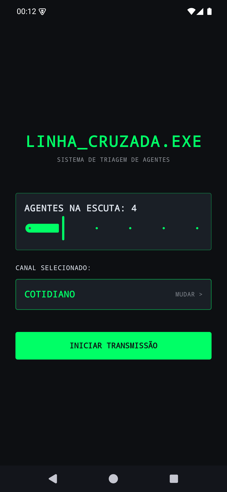
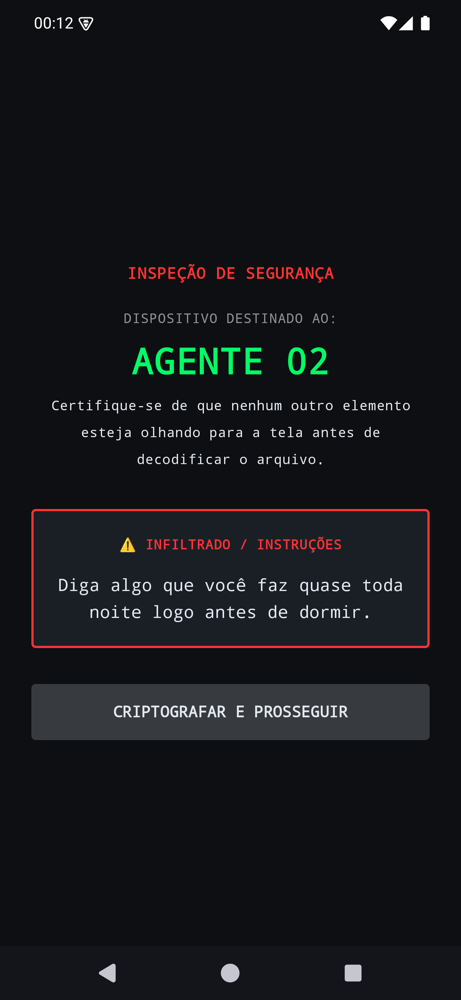
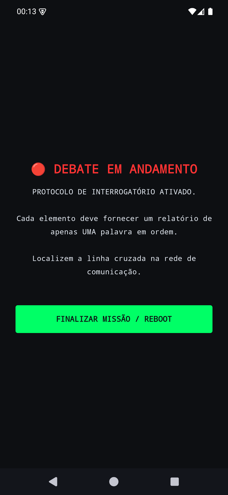

# 🕵️ Linha_Cruzada

**Jogo de festa local para Android — descubra quem recebeu a pergunta diferente.**

---

## 📡 Sobre

**Linha_Cruzada** é um jogo de festa **local** (passa-o-celular): um único aparelho é passado
de mão em mão entre os jogadores. **A partida roda offline** — o estado do jogo e as categorias
que você cria ficam no aparelho. O login de agente (**Firebase Auth** — Google ou e-mail/senha)
abre a sessão, e os canais padrão vêm do **Cloud Firestore** com **cache offline** (Room), então
continuam disponíveis mesmo sem rede.

A cada partida o app sorteia **um impostor** entre os agentes e distribui duas perguntas
**parecidas, mas sutilmente diferentes**:

- os jogadores do **grupo** recebem a pergunta `grupo` (canal seguro 🟢);
- o **impostor** recebe a pergunta `impostor` (infiltrado 🔴).

Depois que cada um lê sua diretriz em segredo, o grupo debate e tenta descobrir **quem
recebeu a pergunta divergente** pelas respostas fora do padrão.

> **Exemplo:** o grupo recebe _"Diga algo que você faz quase todo dia de manhã logo após
> acordar"_ e o impostor recebe _"Diga algo que você faz quase toda noite logo antes de
> dormir"_. As respostas parecem plausíveis — até alguém escorregar.

## 🎮 Como jogar

1. **Acesso** — autentique-se como agente (Google ou e-mail/senha). A sessão fica salva para as próximas partidas.
2. **Setup** — escolha o número de agentes (3 a 8) e o canal (categoria).
3. **Transmissão** — o app sorteia o impostor e uma rodada.
4. **Passa-telefone** — cada agente lê sua diretriz em segredo e passa o aparelho.
5. **Debate** — todos respondem em uma palavra, por vez, e discutem para achar o infiltrado.
6. **Reboot** — finalize a missão e recomece com um novo sorteio.

> Para trocar de agente, toque em **`x SAIR`** na tela de triagem: a sessão é encerrada e o app volta ao login.

## 📸 Telas

| Triagem de agentes | Diretriz secreta | Debate |
|:---:|:---:|:---:|
|  |  |  |
| Escolha de agentes e canal | O infiltrado recebe a pergunta divergente | Interrogatório em andamento |

## ✨ Funcionalidades

- **Login de agente:** autenticação via **Firebase Auth** — Google e e-mail/senha —, com
  validação de credenciais, mensagens de erro claras (credenciais inválidas, e-mail já
  cadastrado) e sessão persistente. Dá para **encerrar a sessão** (`x SAIR`) a qualquer
  momento na tela de triagem, voltando ao login.
- **Canais na nuvem com cache offline:** os temas padrão vêm do **Cloud Firestore** e são
  espelhados no **Room**; sem rede, o app usa o cache (ou os canais embutidos nos assets).
- **Setup rápido:** slider de 3 a 8 agentes e seleção do canal ativo.
- **Categorias customizadas:** crie as suas (nome + rodadas `grupo`/`impostor`), com criação,
  edição e exclusão — persistidas localmente via **Room**.
- **Sorteio justo:** exatamente **um** impostor e **uma** rodada aleatória por partida.
- **Revelação sigilosa por jogador:** o texto só aparece depois de decodificar; verde =
  canal seguro (grupo), vermelho = infiltrado (impostor).
- **Debate + reboot:** tela de discussão e reinício limpo para a próxima rodada.
- **Jogo offline:** o estado da partida e suas categorias nunca saem do aparelho.

## 🗂️ Categorias incluídas

Três canais embutidos, cada um com 5 rodadas:

| Canal | Tema |
|---|---|
| **Cotidiano** | Rotina do dia a dia |
| **Cultura Pop** | Filmes, séries, heróis e vilões |
| **Relacionamentos** | Encontros, presentes e situações |

Novas categorias padrão são arquivos JSON em [`app/src/main/assets/`](app/src/main/assets/)
no formato `{ "tema": string, "rodadas": [ { "grupo": string, "impostor": string } ] }`.

## 🎨 Estética

Identidade visual de **espionagem**: fonte monospace, rótulos como `AGENTE 0X`,
`CANAL SEGURO` e `INSPEÇÃO DE SEGURANÇA`, e a paleta neon sobre fundo escuro:

| Cor | Hex | Uso |
|---|---|---|
| 🟩 `SpyGreen` | `#00FF66` | canal seguro / grupo / acento principal |
| 🟥 `SpyRed` | `#FF3333` | alerta / impostor / infiltrado |
| ⬛ `SpyBlack` | `#0D0F12` | fundo |
| ▪️ `SpyGray` | `#1A1F26` | cartões / superfícies |
| ⬜ `SpyTextWhite` | `#E2E8F0` | texto |

## 🛠️ Stack técnica

- **Linguagem:** Kotlin `2.2.10` (Java 11)
- **UI:** Jetpack Compose (BOM `2026.02.01`) + Material 3 + Navigation-Compose
- **Arquitetura:** Clean Architecture + MVVM (`domain` / `data` / `di` / `ui`)
- **DI:** Hilt `2.59.2` via KSP
- **Nuvem:** Firebase Auth + Cloud Firestore (Google Sign-In via `play-services-auth`)
- **Persistência local:** Room `2.7.1` via KSP (categorias customizadas + cache de temas)
- **Build:** Android Gradle Plugin `9.2.1`, Gradle `9.4.1`
- **SDK:** `minSdk 26` · `targetSdk 36` · `compileSdk 36`
- **Namespace / applicationId:** `com.game.impostor`
- Sem analytics nem telemetria — a rede é usada **somente** para login e leitura de temas.

## 🚀 Como compilar e instalar

**Pré-requisitos:** JDK 11+, Android SDK 36 e um device/emulador com Android 8.0 (API 26) ou superior.

> **Firebase:** o login e os temas na nuvem exigem um projeto Firebase configurado — um
> `app/google-services.json` válido (não versionado), provedores de Auth (Google + e-mail/senha)
> habilitados, o SHA-1 do app registrado, o *web client id* em
> `app/src/main/res/values/strings.xml` e as Security Rules do Firestore exigindo
> `request.auth != null`. Sem isso, o app compila normalmente, mas o login não conclui.

| Objetivo | PowerShell | bash |
|---|---|---|
| Compilar o APK debug | `.\gradlew.bat assembleDebug` | `./gradlew assembleDebug` |
| Rodar os testes unitários | `.\gradlew.bat testDebugUnitTest` | `./gradlew testDebugUnitTest` |
| Instalar no device/emulador | `adb install -r app/build/outputs/apk/debug/app-debug.apk` | idem |

O APK gerado fica em `app/build/outputs/apk/debug/app-debug.apk`.

## 🗺️ Roadmap

Planejado (ainda **não** implementado):

- [ ] Exportar / importar categorias customizadas em JSON.
- [ ] Temporizador opcional de rodada durante o debate.

## 🔒 Privacidade

Linha_Cruzada **não tem anúncios, analytics nem telemetria**. A única permissão é `INTERNET`,
usada **exclusivamente** para o Firebase Auth (login) e a leitura de temas no Cloud Firestore.
O estado das partidas e as categorias que você cria **ficam no aparelho** (Room) — nenhum dado
de jogo é enviado para a nuvem.

---

Feito com Kotlin + Jetpack Compose · interface em português 🇧🇷

